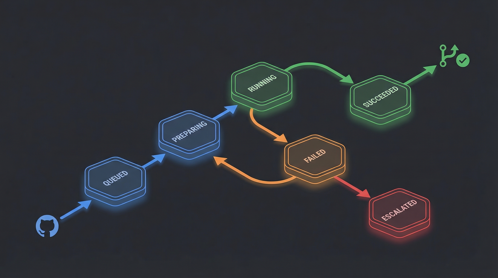

# Symphony-CC


> One GitHub Issue, from code to PR -- autonomous Claude Code orchestration.


---

## What is Symphony-CC?

Symphony-CC turns GitHub Issues into Pull Requests -- autonomously. It polls your repository for labeled issues, spins up isolated git worktrees, runs Claude Code in non-interactive `--print` mode, and opens PRs with the results. A finite state machine (FSM) tracks each task through its lifecycle: **QUEUED -> PREPARING -> RUNNING -> SUCCEEDED / PR_CREATED**, with automatic retries on failure (up to 3 attempts) before escalating. Post an issue, label it, and walk away.

## Features

- **Unattended autonomous execution** -- Label an issue and leave. Symphony handles the rest.
- **Parallel processing** -- Run up to 2 tasks concurrently, each in its own git worktree.
- **Automatic retry + escalation** -- Failed tasks retry up to 3 times, then escalate with full logs.
- **Rich TUI dashboard** -- Real-time view of queues, active tasks, and completion status.
- **GitHub comments + Slack notifications** -- Get notified on success, failure, or escalation.
- **Per-issue budget cap** -- Default $5 USD limit per task to prevent runaway costs.
- **Frontmatter optional** -- Issues work with or without YAML frontmatter.
- **`/symphony` slash command** -- Integrate directly into your Claude Code workflow.


## Quick Start

### Prerequisites

- **Python 3.12+**
- **Claude Code** CLI installed and authenticated
- **GitHub CLI** (`gh`) installed and authenticated
- **Git** 2.15+ (worktree support)

### Installation

```bash
git clone https://github.com/qjc-office/symphony-cc.git
cd symphony-cc
pip install -e .
```

### Usage

**1. Initialize your project:**

```bash
cd your-project
symphonyctl init --repo owner/repo --budget 5
```

This creates a `config.yaml` with sensible defaults. Use `--non-interactive` for CI environments.

**2. Create a GitHub Issue with the trigger label:**

Add the `symphony:ready` label to any issue. Optionally include YAML frontmatter:

```markdown
---
mode: feature
max_iterations: 10
budget_usd: 3
---

## Task

Add input validation to the /api/users endpoint using zod schemas.

## Acceptance Criteria

- All request bodies validated with zod
- Error responses follow RFC 7807 format
- Tests cover valid and invalid inputs
```

**3. Start Symphony:**

```bash
# Foreground (see logs in real-time)
symphonyctl start --foreground

# Background daemon
symphonyctl start

# Or jump straight to the dashboard
symphonyctl dashboard
```

Symphony picks up the issue, creates a worktree, runs Claude Code, and opens a PR.

## Architecture



### FSM State Flow

```
QUEUED ──> PREPARING ──> RUNNING ──> SUCCEEDED ──> PR_CREATED
              |             |             |
              |             v             |
              |          FAILED ──> RETRYING ──> (back to PREPARING)
              |                         |
              |                         v (max retries exceeded)
              |                     ESCALATED
              v
           FAILED (workspace setup error)
```

### Module Structure

| Module | Responsibility |
|--------|---------------|
| `lib/cli.py` | `symphonyctl` CLI -- start, stop, status, dispatch, retry, logs, dashboard, init |
| `lib/config.py` | YAML config loading with environment variable overrides |
| `lib/orchestrator.py` | FSM state machine managing the full task lifecycle |
| `lib/runner.py` | Executes `claude --print` in agent mode |
| `lib/workspace.py` | Git worktree creation and cleanup for task isolation |
| `lib/tracker.py` | GitHub Issues polling via `gh` CLI |
| `lib/notifier.py` | GitHub comment posting and Slack webhook integration |
| `lib/dashboard.py` | Rich TUI dashboard for real-time monitoring |
| `lib/init.py` | Project initialization and config scaffolding |
| `lib/workflow.py` | Workflow template rendering |
| `lib/logger.py` | Structured JSON logging |
| `templates/` | WORKFLOW.md, symphony-task.yml, issue-template.md |

## Configuration

Symphony is configured via `config.yaml` at your project root. Every option can be overridden with environment variables.

### Full Configuration Reference

```yaml
tracker:
  kind: github
  repo: owner/repo
  trigger_label: "symphony:ready"
  active_labels: ["symphony:in-progress"]
  terminal_labels: ["symphony:done", "symphony:failed"]

polling:
  interval_s: 30

workspace:
  root: ~/symphony-workspaces

agent:
  max_concurrent: 2
  max_retries: 3
  retry_delay_s: 60
  max_budget_usd: 5
  model: opus
  allowed_tools: "Bash(*),Read(*),Write(*),Edit(*),Glob(*),Grep(*)"
  default_mode: feature
  default_max_iterations: 10

hooks:
  after_create: ""
  before_run: ""
  after_run: ""

notifier:
  github_comment: true
  slack_webhook_url: ""
  events: [succeeded, failed, escalated]
```

### Environment Variable Overrides

| Variable | Config Path | Example |
|----------|-------------|---------|
| `SYMPHONY_AGENT_MAX_CONCURRENT` | `agent.max_concurrent` | `4` |
| `SYMPHONY_AGENT_MAX_RETRIES` | `agent.max_retries` | `5` |
| `SYMPHONY_AGENT_RETRY_DELAY_S` | `agent.retry_delay_s` | `120` |
| `SYMPHONY_AGENT_MAX_BUDGET_USD` | `agent.max_budget_usd` | `10` |
| `SYMPHONY_AGENT_MODEL` | `agent.model` | `sonnet` |
| `SYMPHONY_POLLING_INTERVAL_S` | `polling.interval_s` | `60` |
| `SYMPHONY_WORKSPACE_ROOT` | `workspace.root` | `/tmp/symphony` |
| `SYMPHONY_TRACKER_REPO` | `tracker.repo` | `owner/repo` |
| `SYMPHONY_NOTIFIER_SLACK_WEBHOOK` | `notifier.slack_webhook_url` | `https://hooks.slack.com/...` |

Environment variables always take precedence over `config.yaml` values.

## CLI Reference

| Command | Description |
|---------|-------------|
| `symphonyctl start [-f/--foreground]` | Start the polling loop and orchestrator. Use `-f` to run in the foreground. |
| `symphonyctl stop` | Stop the background daemon gracefully. |
| `symphonyctl status` | Show current queue, active tasks, and completed tasks. |
| `symphonyctl dispatch <issue_number>` | Manually dispatch a specific issue, bypassing the polling loop. |
| `symphonyctl retry <issue_number>` | Retry a failed issue from scratch. |
| `symphonyctl logs [--issue N] [--tail N]` | View structured logs. Filter by issue or tail recent entries. |
| `symphonyctl dashboard` | Launch the Rich TUI dashboard for real-time monitoring. |
| `symphonyctl init [options]` | Initialize Symphony in the current project. |

### `symphonyctl init` Options

| Flag | Description | Default |
|------|-------------|---------|
| `--repo owner/repo` | GitHub repository | Detected from git remote |
| `--budget N` | Per-issue budget in USD | `5` |
| `--workspace-root PATH` | Worktree root directory | `~/symphony-workspaces` |
| `--non-interactive` | Skip interactive prompts | `false` |

## Notifications

### GitHub Comments

Enabled by default. Symphony posts status updates directly on the issue:

- **On success**: Summary of changes + link to the PR
- **On failure**: Error logs and retry count
- **On escalation**: Full diagnostic info for human review

### Slack Webhook

Configure `notifier.slack_webhook_url` in `config.yaml` or set `SYMPHONY_NOTIFIER_SLACK_WEBHOOK`:

```yaml
notifier:
  slack_webhook_url: "https://hooks.slack.com/services/T00/B00/xxx"
  events: [succeeded, failed, escalated]
```

## Design Decisions

| # | Decision | Rationale |
|---|----------|-----------|
| 1 | GitHub Issues via `gh` CLI | No MCP dependency; works everywhere `gh` is installed. |
| 2 | Python 3.12+ | Native asyncio + subprocess support ideal for orchestration. |
| 3 | `claude --print` mode | Non-interactive execution suited for autonomous automation. |
| 4 | JSON-backed FSM | Recoverable state on crash; trivial retry logic. |
| 5 | `max_concurrent=2` default | Respects Claude Max Plan rate limits out of the box. |

## Contributing

Contributions are welcome! Please see [CONTRIBUTING.md](CONTRIBUTING.md) for guidelines.

```bash
# Run tests
pytest

# Run tests with coverage
pytest --cov=lib
```

## License

[MIT](LICENSE)

## Test

This is a test from issue-45 workspace
